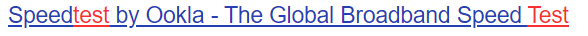
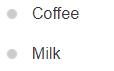
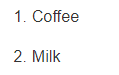

# 前端介绍——html 三件套之 html

- [例子](#例子)
  - [笔趣阁](#笔趣阁)
    - [头部](#头部)

---

### 例子

#### 笔趣阁

当然, 为了学习没有那么枯燥, 我把笔趣阁中[《赘婿》](http://www.shuquge.com/txt/99462/24031460.html)第一章的源代码
放在下面, 通过插件(Browser Preview) 可以在 vscode 中打开分屏左右观看

```html

<!DOCTYPE html>
<html>
 <head>
  <meta http-equiv="Content-Type" content="text/html; charset=utf-8" />
  <meta http-equiv="Cache-Control" content="no-transform" />
  <meta http-equiv="Cache-Control" content="no-siteapp" />
  <meta http-equiv="mobile-agent" content="format=html5; url=http://m.shuquge.com/chapter/99462_33369500.html" />
  <meta http-equiv="mobile-agent" content="format=xhtml; url=http://m.shuquge.com/chapter/99462_33369500.html" />
  <title>豪婿_第一章  我只想当个窝囊废_书趣阁_笔趣阁</title>
  <meta name="keywords" content="豪婿,第一章  我只想当个窝囊废,豪婿最新章节,豪婿txt阅读,豪婿 绝人,豪婿笔趣阁,书趣阁_笔趣阁" />
  <meta name="description" content="书趣阁_笔趣阁提供了绝人创作的都市言情《豪婿》干净清爽无错字的文字章节：第一章  我只想当个窝囊废在线阅读,豪婿笔趣阁。" />
  <link href="/css/style.css" rel="stylesheet" type="text/css" />
  <script src="http://apps.bdimg.com/libs/jquery/1.8.3/jquery.min.js"></script>
  <script src="/js/common.js"></script>
  <script src="/js/read.js"></script>
  <script type="text/javascript">
    var preview_page = "/txt/99462/index.html";
    var next_page = "24031461.html";
    var index_page = "/txt/99462/index.html";
    function jumpPage() {
      if (event.keyCode == 37) location = preview_page;
      if (event.keyCode == 39) location = next_page;
      if (event.keyCode == 13) location = index_page;
    }
    document.onkeydown = jumpPage;
  </script>
 </head>
 <body id="wrapper">
  <div class="header">
   <div class="wrap">
    <div class="logo">
     <a href="/" title="书趣阁_笔趣阁">书趣阁_笔趣阁<em>www.shuquge.com</em></a>
    </div>
    <script>search();</script>
   </div>
  </div>
  <div class="nav">
   <ul>
    <li class="this"><a href="http://www.shuquge.com" title="书趣阁_笔趣阁">首页</a></li>
    <li><a href="http://www.shuquge.com/category/1_1.html">玄幻</a></li>
    <li><a href="http://www.shuquge.com/category/2_1.html">武侠</a></li>
    <li><a href="http://www.shuquge.com/category/3_1.html">都市</a></li>
    <li><a href="http://www.shuquge.com/category/4_1.html">历史</a></li>
    <li><a href="http://www.shuquge.com/category/5_1.html">侦探</a></li>
    <li><a href="http://www.shuquge.com/category/6_1.html">网游</a></li>
    <li><a href="http://www.shuquge.com/category/7_1.html">科幻</a></li></li>
    <li><a href="/top.html">排行榜</a></li>
    <li><a href="/full/">全本</a></li>
    <li><a href="/modules/article/bookcase.php">书架</a></li>
   </ul>
  </div>
  <div class="clear"></div>
  <script>read1();</script>
  <div class="book reader">
   <div class="path">
    <div class="p">
     <a href="/">书趣阁_笔趣阁</a> &gt;
     <a href="http://www.shuquge.com/txt/99462/index.html">豪婿</a> &gt;第一章  我只想当个窝囊废     <span class="oninfo"><script>textselect();</script></span>
     <div style="float: right;">
      <a style="margin: 15px;padding: 5px;background-color: #459DF5;color: #ffffff;" href="Javascript:void(0);" onclick="javascript:$.ajax({cache:false,url:'/addbookcase/99462/24031460.php',success:function(data){if('-1'==data){alert('先登录再收藏！');}else{alert('加入书架成功！');}},error:function(){alert('加入书架成功！');}});">加入书架</a><a style="margin: 15px;padding: 5px;background-color: #459DF5;color: #ffffff;"  href="Javascript:void(0);" onclick="javascript:$.ajax({cache:false,url:'/recommend/99462.php',success:function(data){alert('推荐本书成功！');}});">推荐本书</a>
     </div>
    </div>
   </div>
   <div class="content">
    <h1>第一章  我只想当个窝囊废</h1>
    <div class="link">
     <span>推荐阅读：
     <a href="http://www.shuquge.com/txt/5809/index.html">元尊</a>
、     <a href="http://www.shuquge.com/txt/38287/index.html">逆剑狂神</a>
、     <a href="http://www.shuquge.com/txt/13139/index.html">修真四万年</a>
、     <a href="http://www.shuquge.com/txt/79470/index.html">都市超级医仙</a>
、     <a href="http://www.shuquge.com/txt/107868/index.html">首充六元的剑</a>
、     <a href="http://www.shuquge.com/txt/70/index.html">大主宰</a>
、     <a href="http://www.shuquge.com/txt/73674/index.html">一品道门</a>
、     <a href="http://www.shuquge.com/txt/37426/index.html">末世大回炉</a>
、     <a href="http://www.shuquge.com/txt/73779/index.html">牧神记</a>
、     <a href="http://www.shuquge.com/txt/57849/index.html">万域之王</a>
     </span>
    </div>
    <script>read2();</script>
    <div id="content" class="showtxt">
&nbsp;&nbsp;&nbsp;&nbsp;“小少爷，你一定要跟我们回去，韩家现在需要你来主持大局。”
<br/>
<br/>&nbsp;&nbsp;&nbsp;&nbsp;“你父亲病危，哥哥入狱，现在只有你才能够撑起韩家。”
<br/>
<br/>&nbsp;&nbsp;&nbsp;&nbsp;“你奶奶说了，务必让我们把你带回去。”
<br/>
<br/>&nbsp;&nbsp;&nbsp;&nbsp;云城梓桐街，韩三千拎着一个礼品盒，穿着路边摊买来的衣服，神情漠然。
<br/>
<br/>&nbsp;&nbsp;&nbsp;&nbsp;“我从小不会花言巧语，讨不得她的欢心。哥哥深受宠爱，奶奶怕我抢走哥哥继承人的位置，把我赶出韩家。”
<br/>
<br/>&nbsp;&nbsp;&nbsp;&nbsp;“入赘苏家三年，受尽屈辱，韩家何时有过只言片语的关心。是她逼我离开韩家，现在一句话又要让我回去，当我韩三千是一条狗吗？”
<br/>
<br/>&nbsp;&nbsp;&nbsp;&nbsp;“我现在只想安安静静的当一个窝囊废，谁他妈也别来打扰我。”
<br/>
<br/>&nbsp;&nbsp;&nbsp;&nbsp;韩三千迈着大步离开，留下一行人面面相觑。
<br/>
<br/>&nbsp;&nbsp;&nbsp;&nbsp;苏家，云城一个二流世家，三年前韩三千落魄如狗，是苏家老爷子亲指婚约，当时一场婚礼惊动整个云城，不过轰动的原因却是因为苏迎夏嫁给了一个不知名的废物，沦为整个云城笑话。
<br/>
<br/>&nbsp;&nbsp;&nbsp;&nbsp;韩三千的真实身份，只有苏家老爷子一人知晓，可是婚礼两个月之后，苏家老爷子因病去世，自此韩三千的身份无人知晓，而他，也坐实了无用废婿的身份。
<br/>
<br/>&nbsp;&nbsp;&nbsp;&nbsp;三年来，韩三千受尽冷嘲热讽，冷眼相待。不过这些和被赶出韩家这件事情相比，后者更是凉了人心。
<br/>
<br/>&nbsp;&nbsp;&nbsp;&nbsp;他已经认了，脊梁骨被人戳久也成了习惯。
<br/>
<br/>&nbsp;&nbsp;&nbsp;&nbsp;今天是苏家老奶奶的寿辰，韩三千精心挑选了一份礼物，价值不高，注定会被人嘲笑，不过兜无二两银，他能做到的，也就这么多。
<br/>
<br/>&nbsp;&nbsp;&nbsp;&nbsp;至于刚才发生的那件事情，韩三千内心平静无波，甚至有点想笑。
<br/>
<br/>&nbsp;&nbsp;&nbsp;&nbsp;他哥哥巧舌如簧，虽然能讨得奶奶欢心，可为人却是嚣张跋扈，私生活糜烂，出事是迟早的。
<br/>
<br/>&nbsp;&nbsp;&nbsp;&nbsp;说不定，这是天要亡韩家。
<br/>
<br/>&nbsp;&nbsp;&nbsp;&nbsp;可是跟我有什么关系呢？我不过是苏家被人唾弃的上门女婿而已。
<br/>
<br/>&nbsp;&nbsp;&nbsp;&nbsp;回到苏家别墅，一个靓丽的身影站在门口，焦躁不堪。
<br/>
<br/>&nbsp;&nbsp;&nbsp;&nbsp;苏迎夏，一个非常漂亮的女人，韩三千有名无实的老婆，也是因为她足够优秀，所以三年前的婚礼才会成为笑话。
<br/>
<br/>&nbsp;&nbsp;&nbsp;&nbsp;韩三千三步并作两步，小跑到苏迎夏身边，说道：“迎夏，你在等谁呢？”
<br/>
<br/>&nbsp;&nbsp;&nbsp;&nbsp;苏迎夏充满厌烦的看了一眼韩三千，说道：“给奶奶的礼物准备好了吗？”
<br/>
<br/>&nbsp;&nbsp;&nbsp;&nbsp;韩三千扬了扬手里的礼品盒说道：“准备好了，我花了很大的心思才选到的。”
<br/>
<br/>&nbsp;&nbsp;&nbsp;&nbsp;苏迎夏连看都没看一眼，三年前也不知道爷爷发了什么神经，非要让她和韩三千结婚，而且还让韩三千当上门女婿。
<br/>
<br/>&nbsp;&nbsp;&nbsp;&nbsp;更让苏迎夏不解的是，爷爷去世前还握着她的手，告诫她不要瞧不起韩三千。
<br/>
<br/>&nbsp;&nbsp;&nbsp;&nbsp;三年了，苏迎夏想不明白这个废物有什么值得爷爷另眼相看的地方，要不是顾忌苏家名声，她早就想和韩三千离婚了。
<br/>
<br/>&nbsp;&nbsp;&nbsp;&nbsp;“等会儿你别乱说话，今天所有的亲戚都会到场，免不了对你冷嘲热讽，你给我忍着，我不想因为你丢脸。”苏迎夏提醒道。
<br/>
<br/>&nbsp;&nbsp;&nbsp;&nbsp;韩三千笑着点了点头，一副满不在乎的样子。
<br/>
<br/>&nbsp;&nbsp;&nbsp;&nbsp;看到韩三千的表情，苏迎夏恨不得一头撞死，他没有背景，有点真本事也行啊，可是整整三年了，他在家里，除了扫地洗衣服做饭，从来没有干过其他事情。
<br/>
<br/>&nbsp;&nbsp;&nbsp;&nbsp;苏迎夏对自己的态度，韩三千没有半点不满，因为两人在没有任何感情基础下结婚，而且还是嫁给他这个废物，对苏迎夏来说是一件非常不公平的事情，所以他能够理解苏迎夏。
<br/>
<br/>&nbsp;&nbsp;&nbsp;&nbsp;两人走到客厅里，苏家亲戚几乎已经全部到场，热闹非凡。
<br/>
<br/>&nbsp;&nbsp;&nbsp;&nbsp;“迎夏，你可算是来了。”
<br/>
<br/>&nbsp;&nbsp;&nbsp;&nbsp;“今天奶奶生日，你怎么来得这么晚。”
<br/>
<br/>&nbsp;&nbsp;&nbsp;&nbsp;“不会是去给奶奶准备什么惊喜了吧。”
<br/>
<br/>&nbsp;&nbsp;&nbsp;&nbsp;亲戚热络的和苏迎夏打着招呼，完全忽略了韩三千的存在。
<br/>
<br/>&nbsp;&nbsp;&nbsp;&nbsp;习惯了当背景板的韩三千也不在意，被忽略了才好，免得有人拿他当笑话看。
<br/>
<br/>&nbsp;&nbsp;&nbsp;&nbsp;不过总有人对他不满，苏迎夏的堂哥苏海超，每一次见面，必然会刁难韩三千，而且把韩三千贬得一文不值。甚至韩三千在云城的废婿名号，都是苏海超一手促成的，经常在外面说些韩三千的坏话。
<br/>
<br/>&nbsp;&nbsp;&nbsp;&nbsp;“韩三千，你这手里拿着的，不会是给奶奶的礼物吧？”苏海超一脸笑意的看着韩三千，这么大点的东西，还用礼品纸包着，一看就是廉价货。
<br/>
<br/>&nbsp;&nbsp;&nbsp;&nbsp;“是啊。”韩三千大大方方的承认道。
<br/>
<br/>&nbsp;&nbsp;&nbsp;&nbsp;苏海超嗤笑道：“这是个什么东西，不会是从路边摊买来的吧？”
<br/>
<br/>&nbsp;&nbsp;&nbsp;&nbsp;韩三千摇着头，说道：“从礼品店买的。”
<br/>
<br/>&nbsp;&nbsp;&nbsp;&nbsp;虽然实诚，不过他这番话却是引起了哄堂大笑，苏迎夏表情凝固，没想到这才刚到家里，她就要因为韩三千丢脸了。
<br/>
<br/>&nbsp;&nbsp;&nbsp;&nbsp;不过通常这种时候，苏迎夏都是不说话的，她把自己和韩三千当作两家人，韩三千怎么丢脸她不管，只要不把话题扯到她身上就行。
<br/>
<br/>&nbsp;&nbsp;&nbsp;&nbsp;“你是来搞笑的吗？奶奶今天八十大寿，你准备礼物，这么不用心吗？”苏海超走到客厅的茶几旁，上面摆满了各种精贵的礼物，一看就价值不菲，和韩三千的礼品盒相比，简直就是云泥之别。
<br/>
<br/>&nbsp;&nbsp;&nbsp;&nbsp;“看看我给奶奶送的什么，陈年普洱，知道这饼茶多少钱吗？八十八万。”苏海超得意的说道。
<br/>
<br/>&nbsp;&nbsp;&nbsp;&nbsp;“呵呵，真好。”韩三千看了一眼苏迎夏，之前苏迎夏已经告诫过他了，少说话，所以他也是惜字如金的回答。
<br/>
<br/>&nbsp;&nbsp;&nbsp;&nbsp;苏海超摆明想用自己的礼物在韩三千面前秀优越感，继续说道：“从这饼茶上面扣点渣渣，都比你的礼物贵，你说是吧，渣渣。”
<br/>
<br/>&nbsp;&nbsp;&nbsp;&nbsp;韩三千笑而不语，整个客厅里充斥着嗤笑的声音。
<br/>
<br/>&nbsp;&nbsp;&nbsp;&nbsp;虽然苏迎夏打定主意不参合韩三千的事情，可说到底，韩三千还是她的老公，有证有婚礼，哪怕这三年以来她从来没有让韩三千碰过，没有夫妻之实，但韩三千当着这么多亲戚的面丢脸，她面子上也过不去。
<br/>
<br/>&nbsp;&nbsp;&nbsp;&nbsp;“苏海超，差不多行了，你有钱是你的事，送多贵的礼物跟我们没关系，不用拿出来显摆。”苏迎夏一脸不悦的说道。
<br/>
<br/>&nbsp;&nbsp;&nbsp;&nbsp;韩三千惊讶的看着苏迎夏，整整三年以来，这是苏迎夏第一次帮他说话。
<br/>
<br/>&nbsp;&nbsp;&nbsp;&nbsp;“显摆？迎夏，你这话可说错了，我有必要在一个废物面前显摆吗？我只是觉得他不重视奶奶的寿辰而已，还有你，他不懂事，没钱送礼，难道你就不知道帮衬一下，反正这个废物也是吃软饭的。还是说，根本就是你不重视奶奶的寿辰？”苏海超冷笑道。
<br/>
<br/>&nbsp;&nbsp;&nbsp;&nbsp;“你……”苏迎夏面红耳赤，她家里在苏家地位最低，也是生活条件最差的，动辄几十万的礼物，她还真拿不出手。
<br/>
<br/>&nbsp;&nbsp;&nbsp;&nbsp;这时候，韩三千突然站起身，走到苏海超身边，在普洱上嗅了嗅。
<br/>
<br/>&nbsp;&nbsp;&nbsp;&nbsp;“你干什么，这是给奶奶的礼物，是你这个废物能闻的吗？”苏海超愤怒的说道。
<br/>
<br/>&nbsp;&nbsp;&nbsp;&nbsp;韩三千眉头微皱，说道：“普洱越陈越香，也是因为这个缘故，市场上年份越久的普洱，价格就会越贵。可正因为如此，很多商贩会利用年份造价，刻意抬高价格。”
<br/>
<br/>&nbsp;&nbsp;&nbsp;&nbsp;“普洱还分生茶和熟茶，你手里这饼茶叶以青绿墨绿为主，可以判断为生茶。生茶有着熟茶不可比拟的口感，可新制生茶却有着茶叶咖啡碱，对人体肠胃有很大的刺激性，需要长时间的陈放，陈放周期越长，含量也会越少。”
<br/>
<br/>&nbsp;&nbsp;&nbsp;&nbsp;“但是你手里这饼茶，由于刻意做旧，陈放周期远远不够，喝了之后，必然会对身体产生危害。”
<br/>
<br/>&nbsp;&nbsp;&nbsp;&nbsp;“我是渣渣不错，可你以次充好，甚至还要危害奶奶的身体健康，岂不是比我更渣。”
<br/>
<br/>&nbsp;&nbsp;&nbsp;&nbsp;韩三千掷地有声，指着苏海超，整个苏家别墅，寂静无声！     <br />　　http://www.shuquge.com/txt/99462/24031460.html
     <br />
     <br />　　请记住本书首发域名：www.shuquge.com。书趣阁_笔趣阁手机版阅读网址：m.shuquge.com
    </div>
    <script>read3();</script>
    <div class="page_chapter">
     <ul>
      <li><a href="/txt/99462/index.html">上一章</a></li>
      <li><a href="/txt/99462/index.html">返回目录</a></li>
      <li><a href="24031461.html">下一章</a></li>
     </ul>
    </div>
    <script>read4();</script>
   </div>
  </div>
  <div class="footer">
   <div class="link">
    <span>豪婿相关推荐：
     <a href="http://www.shuquge.com/txt/5809/index.html">元尊</a>
、     <a href="http://www.shuquge.com/txt/7816/index.html">沧元图</a>
、     <a href="http://www.shuquge.com/txt/100/index.html">帝霸</a>
、     <a href="http://www.shuquge.com/txt/8659/index.html">剑来</a>
、     <a href="http://www.shuquge.com/txt/80079/index.html">岳风柳萱</a>
、     <a href="http://www.shuquge.com/txt/99462/index.html">豪婿</a>
、     <a href="http://www.shuquge.com/txt/73488/index.html">天王殿</a>
、     <a href="http://www.shuquge.com/txt/84372/index.html">踏星</a>
、     <a href="http://www.shuquge.com/txt/8194/index.html">明天下</a>
、     <a href="http://www.shuquge.com/txt/119292/index.html">问丹朱</a>
    </span>
   </div>
   <hr />
    <p><a href="http://www.shuquge.com/txt/99462/index.html"><strong>豪婿最新章节</strong></a>内容由网友收集并提供，转载至书趣阁_笔趣阁只是为了宣传《<a href="http://www.shuquge.com/txt/99462/index.html"><strong>豪婿</strong></a>》让更多书友知晓。</p>
    <p>Copyright &copy; 2015 <A href="http://www.shuquge.com">书趣阁_笔趣阁</A> All Rights Reserved.
   <script>tj();readtc();</script>
  </div>
 </body>
</html>
```

接下来我将逐个讲解标签内容.

`<!DOCTYPE html>`

`<!DOCTYPE> `声明必须是 HTML 文档的第一行, 位于 `<html>` 标签之前.  
`<!DOCTYPE>` 声明**不是** HTML 标签; 它是指示 web 浏览器关于页面使用哪个 HTML 版本进行编写的指令.  
**Note:** 如果你们想要编写静态页面, 请始终向 HTML 文档添加 `<!DOCTYPE>` 声明, 这样浏览器才能获知文档类型

#### 头部

**_`<head>`_**

`<head>` 元素包含了所有的头部标签元素. 在 <`head>`元素中你可以插入脚本（scripts）, 样式文件（CSS），及各种 meta 信息.
~~这两个也可以插入在`<body>`.~~
可以添加在头部区域的元素标签为:` <title>`, `<style>,` `<meta>`, `<link>`, `<script>`, `<noscript>` 和 `<base>`。

```html
<head>
  <meta http-equiv="Content-Type" content="text/html; charset=utf-8" />
  <meta http-equiv="Cache-Control" content="no-transform" />
  <meta http-equiv="Cache-Control" content="no-siteapp" />
  <meta
    http-equiv="mobile-agent"
    content="format=html5; url=http://m.shuquge.com/chapter/99462_33369500.html"
  />
  <meta
    http-equiv="mobile-agent"
    content="format=xhtml; url=http://m.shuquge.com/chapter/99462_33369500.html"
  />
  <title>豪婿_第一章 我只想当个窝囊废_书趣阁_笔趣阁</title>
  <meta
    name="keywords"
    content="豪婿,第一章  我只想当个窝囊废,豪婿最新章节,豪婿txt阅读,豪婿 绝人,豪婿笔趣阁,书趣阁_笔趣阁"
  />
  <meta
    name="description"
    content="书趣阁_笔趣阁提供了绝人创作的都市言情《豪婿》干净清爽无错字的文字章节：第一章  我只想当个窝囊废在线阅读,豪婿笔趣阁。"
  />
  <link href="/css/style.css" rel="stylesheet" type="text/css" />
  <script src="http://apps.bdimg.com/libs/jquery/1.8.3/jquery.min.js"></script>
  <script src="/js/common.js"></script>
  <script src="/js/read.js"></script>
  <script type="text/javascript">
    var preview_page = "/txt/99462/index.html";
    var next_page = "24031461.html";
    var index_page = "/txt/99462/index.html";
    function jumpPage() {
      if (event.keyCode == 37) location = preview_page;
      if (event.keyCode == 39) location = next_page;
      if (event.keyCode == 13) location = index_page;
    }
    document.onkeydown = jumpPage;
  </script>
</head>
```

**_`<!DOCTYPE html>`_**
声明文档类型. 很久以前，早期的 HTML(大约 1991 年 2 月)，文档类型声明类似于链接，规定了 HTML 页面必须遵从的良好规则，能自动检测错误和其他有用的东西。使用如下：

**_`<meta>`_**

meta 标签描述了一些基本的元数据。  
`<meta>` 标签提供了元数据.元数据也不显示在页面上，但会被浏览器解析。  
META 元素通常用于指定网页的描述，关键词，文件的最后修改时间，作者，和其他元数据。  
元数据可以使用于浏览器（如何显示内容或重新加载页面），搜索引擎（关键词），或其他 Web 服务。  
`<meta>` 一般放置于 `<head>` 区域

_一般我们不需要特别关心这个_

**_`<title>`_**

title 元素定义了页面的标题,比如这个的显示是这样的
`<title>豪婿_第一章 我只想当个窝囊废_书趣阁_笔趣阁</title>`


**_`<link>`_**

link 可以看作是通过这个网址从外部引入资源,或是其他,简而言之,link 定义了文档和外部资源的关系.
比如像这个,即引入[css](#css)文件
` <link href="/css/style.css" rel="stylesheet" type="text/css" />`  
rel="stylesheet"指定了被链接的文档是个样式表.  
type 属性规定被链接文档的 MIME 类型。
该属性最常见的 MIME 类型是 "text/css"，该类型描述样式表。

**_`<script>`_**

用于加载脚本文件,这个以后会介绍([javascript](#javascript))

**小结:**

|    标签    | 描述                               |
| :--------: | ---------------------------------- |
|  `<head>`  | 定义了文档的信息                   |
| `<title>`  | 定义了文档的标题                   |
|  `<link>`  | 定义了一个文档和外部资源之间的关系 |
|  `<meta>`  | 定义了 HTML 文档中的元数据         |
| `<script>` | 定义了客户端的脚本文件             |
| `<style>`  | 定义了 HTML 文档的样式文件         |

### 内容

**_`<body>`_**
用这个标签包括起来的为 html 的主要内容，可以如果把 head 比作头文件，那么 body 就是你的代码内容.但是又因为 html 严格来说不是一种编译语言,所以这个比喻也不大恰当

```html
<div class="header">
   <div class="wrap">
    <div class="logo">
     <a href="/" title="书趣阁_笔趣阁">书趣阁_笔趣阁<em>www.shuquge.com</em></a>
    </div>
    <script>search();</script>
   </div>
  </div>
  <div class="nav">
   <ul>
    <li class="this"><a href="http://www.shuquge.com" title="书趣阁_笔趣阁">首页</a></li>
    <li><a href="http://www.shuquge.com/category/1_1.html">玄幻</a></li>
    <li><a href="http://www.shuquge.com/category/2_1.html">武侠</a></li>
    <li><a href="http://www.shuquge.com/category/3_1.html">都市</a></li>
    <li><a href="http://www.shuquge.com/category/4_1.html">历史</a></li>
    <li><a href="http://www.shuquge.com/category/5_1.html">侦探</a></li>
    <li><a href="http://www.shuquge.com/category/6_1.html">网游</a></li>
    <li><a href="http://www.shuquge.com/category/7_1.html">科幻</a></li></li>
    <li><a href="/top.html">排行榜</a></li>
    <li><a href="/full/">全本</a></li>
    <li><a href="/modules/article/bookcase.php">书架</a></li>
   </ul>
  </div>
  <div class="clear"></div>
  <script>read1();</script>
```

**_`<div>`_**

**_`<div>`_** 标签定义 HTML 文档中的一个分隔区块或者一个区域部分。

**_`<div>`_** 标签常用于组合块级元素，以便通过 CSS 来对这些元素进行格式化。

**Tips:** 近似的,你们可以看作一张白纸上面你们画的方格,画成一块一块区域, 这里放抽屉,那里放导航栏.

**_`<a>`_**

_`<a>`_ 标签定义超链接，用于从一个页面链接到另一个页面。

_`<a>`_ 元素最重要的属性是 href 属性，它指定链接的目标。

在所有浏览器中，链接的默认外观如下：

- 未被访问的链接带有下划线而且是蓝色的
  
- 已被访问的链接带有下划线而且是紫色的
  
- 活动链接带有下划线而且是红色的
  

**_`<ul>` && `<ol>` && `<li>`_**

`<ul>`代表构建一个无序列表

`<ol>`代表构建一个有序列表

`<li>`代表列表中的元素

```html
<div class="content">
  <h1>第一章 我只想当个窝囊废</h1>
  <div class="link">
    <span
      >推荐阅读：
      <a href="http://www.shuquge.com/txt/5809/index.html">元尊</a>
      、 <a href="http://www.shuquge.com/txt/38287/index.html">逆剑狂神</a> 、
      <a href="http://www.shuquge.com/txt/13139/index.html">修真四万年</a> 、
      <a href="http://www.shuquge.com/txt/79470/index.html">都市超级医仙</a> 、
      <a href="http://www.shuquge.com/txt/107868/index.html">首充六元的剑</a> 、
      <a href="http://www.shuquge.com/txt/70/index.html">大主宰</a> 、
      <a href="http://www.shuquge.com/txt/73674/index.html">一品道门</a> 、
      <a href="http://www.shuquge.com/txt/37426/index.html">末世大回炉</a> 、
      <a href="http://www.shuquge.com/txt/73779/index.html">牧神记</a> 、
      <a href="http://www.shuquge.com/txt/57849/index.html">万域之王</a>
    </span>
  </div>
</div>
```

**_`<h1>`_**
`<h1>` - `<h6>` 标签被用来定义 HTML 标题。

`<h1>` 定义重要等级最高的标题。`<h6>` 定义重要等级最低的标题。

**_`<span>`_**

`<span>` 用于对文档中的行内元素进行组合。

`<span>` 标签没有固定的格式表现。当对它应用样式时，它才会产生视觉上的变化。如果不对 `<span>` 应用样式，那么 `<span>` 元素中的文本与其他文本不会任何视觉上的差异。

`<span>` 标签提供了一种将文本的一部分或者文档的一部分独立出来的方式。

```html
  <p>我的母亲有</p> <span style="color:blue;font-weight:bold">蓝色</span> 的眼睛。</p>

  <p>我的母亲有</p>
	<p style="color:blue;font-weight:bold">蓝色</p>
	<p>的眼睛。</p>

```

两种写法虽然有相似的效果但是有着不同的可读性.

***`<br>`***
回车符,相当于'\n'

&nbsp
空白符